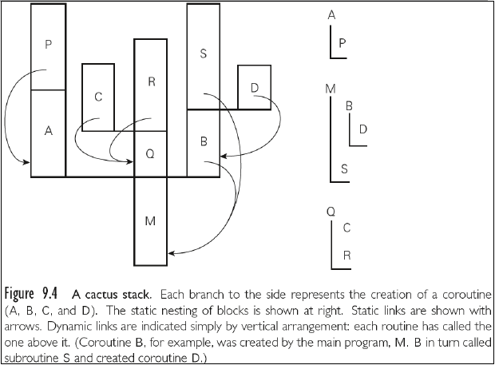
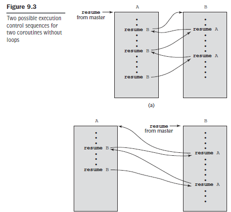
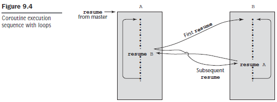

## Lenguajes y Paradigmas de Programación
### Subprogramas

<br>

Daniel Pavez - Victor Reyes

---
### Abstracción de procesos

@ul

- Permite la reutilización de código.
- Se abstraen los detalles de implementación, lo que importa es que se hace, no el cómo.
- Hace más fácil el poder entender un programa, haciendo énfasis en su estructura lógica en vez de los detalles de implementación.

@ulend

---
### Características generales

@ol

- Cada subprograma tiene un único punto de entrada.
- La unidad de programa que realiza la llamada queda en espera durante la ejecución del subprograma.
- El control se devuelve a la unidad de programa que realizó la llamada una vez termina la ejecución del subprograma.

@olend

---
### Funciones y Procedimientos

@ul

- **Función:** Subprograma que a partir de una entrada nos entrega un resultado (`return`).
- **Procedimiento:** Subprograma que no retorna un valor.

@ulend

---
### Header (Cabecera)

@ol

- Especifica que la siguiente unidad sintáctica es la definición de un de un subprograma, de un tipo en particular (método o procedimiento).
- Si el subprograma no es anónimo, el header asigna un nombre al subprograma.
- Podría especificar parámetros.

@olend

@fa[arrow-down]

+++
### Ejemplos de Headers

@ul

- Python:
```Python
def adder (parámetros):
  ...
```

- C:
```C
void adder (parámetros){ //Procedimiento
  ...
}
```

@ulend

---
### Parámetros

@ul

- **Parámetros formales:** Parámetros definidos en el header de un subprograma.
- **Parámetros reales:** Lista de parámetros que son pasados al subprograma al momento de llamarlo.

@ulend

@fa[arrow-down]

+++
### Ejemplo de Parámetros

```C++
#include <stdio.h>
int addNumbers(int a, int b); // prototipo de la función
int main() {
  … 
  sum = addNumbers(n1, n2); // parámetros reales
  return 0;
}

int addNumbers(int a, int b) { // parámetros formales 
  …
}
```

---
### Keyword Parameters

@ul

- Comúnmente los parámetros son asignados según su posición (positional parameters).
- Con el uso de keyword parameters se puede decidir a que parámetro formal asignar un parámetro real.
- Tienen como ventaja que se pueden asignar en cualquier orden, pero a cambio, el usuario del subprograma debe saber los nombres de los parámetros formales.

@ulend

@fa[arrow-down]

+++
### Ejemplo de Keyword Parameters

```Python
def summer(length, list, sum):
  ...

summer(length = my_length, list = my_list, sum = my_sum)

summer(my_length, sum = my_sum, list = my_list)
```

@ulend

@fa[arrow-down]

---
### Parámetros por Defecto

@ul

- Lenguajes como Python, Ruby, PHP, C++ permiten asignar valores por defecto a los parámetros formales.
- Son utilizados en caso de que no se le asigne un valor real a dicho parámetro en la llamada al subprograma.

@ulend

@fa[arrow-down]

+++
### Ejemplo de Parámetros por Defecto

```Python
def compute_pay(income, tax_rate, exemptions = 1):
  ...

pay = compute_pay(20000.0, 0.15)

pay2 = compute_pay(50000.0, 0.19, 5)
```

---
### Métodos de Paso de Parámetros

@ul

- **Paso por valor:** Comúnmente, se pasa una copia del parámetro real, por lo cual, éste no es modificado por la función o procedimiento (sólo lectura).
- **Paso por resultado:** En este caso, el parámetro real es el punto de salida de la función o procedimiento (sólo escritura).
- **Paso por valor-resultado:** Combinación de las 2 anteriores, por lo cual los parámetros reales son de lectura y escritura.

@ulend

@fa[arrow-down]

+++

### Métodos de Paso de Parámetros

@ul

- **Paso por referencia:** Similar al caso anterior, pero más eficiente en tiempo y espacio, ya que es pasada a la función o procedimiento una dirección de memoria.
- **Paso por nombre:** En este caso, el parámetro formal es sustituido textualmente por el parámetro real.

@ulend

@fa[arrow-down]

+++
### Ejemplo de Paso por Valor

```C
void swap1 (int a, int b) {
  int temp = a;
  a = b;
  b = temp:
}

swap1(c,d)
```

- Resultado:

```
a = c
b = d
temp = a
a = b
b = temp
```

@fa[arrow-down]

+++
### Ejemplo de Paso por Referencia

```C
void swap2(int *a, int *b){
  int temp = *a;
  *a = *b;
  *b = temp;
}

swap2(&c, &d);
```
- Resultado:

```C
a = &c
b = &d
temp = *a
*a = *b
*b = temp
```
@fa[arrow-down]

+++
### Ejemplo de Paso por Valor-Resultado

```Ada
procedure swap3(a : in out Integer, b : in out Integer) is
  temp : Integer;
  begin temp := a;
  a := b;
  b := temp;
  end swap3;

swap3(c,d);
```

- Resultado: 

```C
addr_c = &c          |      a = b
addr_d = &d          |     b = temp
a = *addr_c          |     *addr_c = a
b = *addr_d          |     *addr_d = b
temp = a
```

@fa[arrow-down]

+++
### Ejemplo de Paso por Resultado

```C#
void Fixer(out int a, out int b){
  a = 17;
  b = 35;
}
...
Fixer(out c, out d);
```

- Resultado:

```C
addr_c = &c
addr_d = &d
a = 17
b = 35
*addr_c = a
*addr_d = b
```

@fa[arrow-down]

+++
### Ejemplo de Paso por Nombre

```Ada
procedure double(x);
  real x;
begin
  x := x*2
end;

double(a);
```

- Resultado:

```
a = a*2
```

---
### Corutinas

@ul

- Son contextos de ejecución que existen concurrentemente, pero se ejecuta una a la vez, transfiriéndose el control la una a la otra de manera explícita, por nombre.
- Dado que son concurrentes, no pueden compartir el mismo stack.
- Utilizadas para implementar iteradores y threads (hilos).

@ulend

@fa[arrow-down]

+++
### Stacks en Corutinas



@fa[arrow-down]

+++
### Ejemplo de Corutinas

```
sub co1() {
  ...
  resume co2();
  ...
}
```
```
sub co2() {
  ...
  resume co1();
  ...
}
```

@fa[arrow-down]

+++
### Ejecución de Corutinas sin Ciclos



@fa[arrow-down]

+++
### Ejecución de Corutinas con Ciclos

