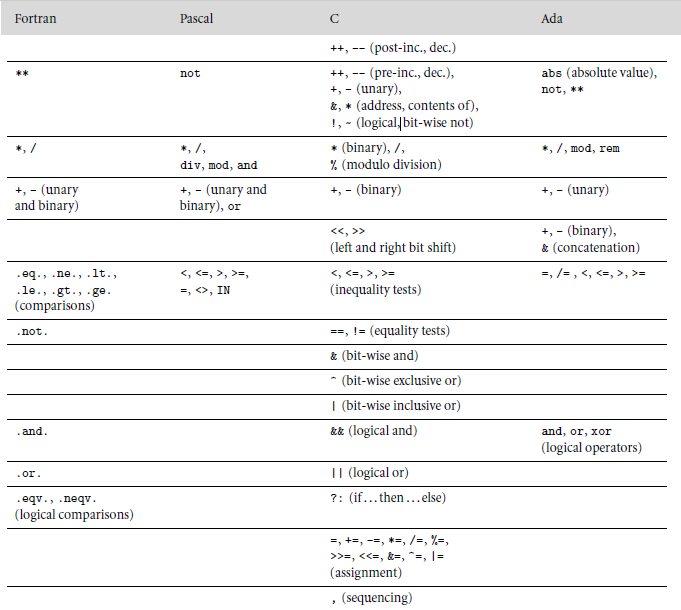
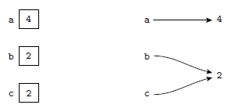

## Lenguajes y Paradigmas de Programación
### Flujo de Control

<br>

Daniel Pavez - Victor Reyes

---
### ¿Qué es el Flujo de Control?

Es el orden que sigue la ejecución de un programa, con el fin de cumplir la tarea deseada.

---

### Categorías de mecanismos utilizados

@ul

- **Secuenciamiento:** El orden en que se ejecutan las sentencias o se evalúan las expresiones (usualmente en el orden en que aparecen en el código del programa).

- **Selección:** Dependiendo de alguna condición en tiempo de ejecución, se realiza una elección entre dos sentencias o expresiones. Los casos más comunes son las sentencias `if` y `case (switch)`.

@ulend

@fa[arrow-down]

+++

@ul

- **Iteración:** Ejecución repetitiva de un cierto fragmento de código, ya sea un cierto número de veces o hasta que una condición (en tiempo de ejecución) sea verdadera. Incluyen las sentencias `for`, `while` y `repeat`.
 
- **Abstracción procedural:** Un conjunto de constructos potencialmente complejos (una subrutina) son encapsulados, con el fin de ser tratados como única unidad, usualmente sujeta a la parametrización.

@ulend

@fa[arrow-down]

+++

- **Recursión:** Una expresión que es definida en términos (versiones más simples) de sí misma, ya sea directa o indirectamente. Para ello, el modelo computacional requiere un "stack" o "pila" para almacenar la información sobre las instancias parcialmente evaluadas de la expresión. Comúnmente, es utilizada por medio de subrutinas que se autoreferencian.

@fa[arrow-down]

+++

- **Concurrencia**: Dos o más fragmentos de un programa que son ejecutados/evaluados "al mismo tiempo", ya sea en paralelo utilizando procesadores separados o intercalados en un único procesado, con el fin de conseguir el mismo efecto.

@fa[arrow-down]

+++

- **Manejo de excepciones y especulación:** Un fragmento de programa es ejecutado de manera optimista, asumiendo que una condición esperada se cumplirá. Si dicha condición no se cumple, la ejecución se ramifica a un "handler" que se ejecuta en lugar del resto del código protegido (en el caso del manejo de excepciones), o en lugar de todo el bloque de código protegido (en el caso de la especulación). Para la especulación, la implementación del lenguaje debe ser capaz de deshacer o retroceder cualquier efecto visible del código protegido.

@fa[arrow-down]

+++

- **Indeterminación:** El orden o elección de las sentencias o expresiones se dejan deliberadamente sin especificar, dando a entender que cualquier alternativa llevará a un resultado correcto. Algunos lenguajes requieren que la elección de aleatoria o pareja, en el sentido formal de la palabra.

---
## Evaluación de expresiones
---

### Operadores

<div align="left">
  <ul>
    <li class="fragment">
      <strong>Prefijos:</strong>
      <ul>
        <li><em>op</em> a b</li>
        <li><em>op</em> (a, b)</li>
        <li>(<em>op</em> a b)</li>
      </ul>
    </li>
    <li class="fragment">
      <strong>Infijos:</strong>
      <ul>
        <li>a <em>op</em> b</li>
      </ul>
    </li>
    <li class="fragment">
      <strong>Sufijos:</strong>
      <ul>
        <li>a b <em>op</em></li>
      </ul>
    </li>
  </ul>
</div>

---

### Precedencia y asociatividad

@ul

- **Precedencia:** En ausencia de paréntesis, especifica el orden en son agrupadas las operaciones, siendo las de mayor precedencia las primeras en se agrupadas.

- **Asociatividad:** Especifica si una secuencia de operadores de la misma precedencia son agrupados hacia la izquierda o hacia la derecha.


- *Importantes cuando se utilizan operadores infijos.*
- *Cada lenguaje tiene su propia definición para la precedencia y asociatividad de sus operadores.*
- *Si no está seguro, haga uso de paréntesis.*

@ulend

@fa[arrow-down]

+++



---

### Corto circuito

Consideremos como ejemplo:
```
(a < b) && (b < c)
```

Si se cumple que `a >= b`, entonces no es necesario evaluar `b < c`, ya que `(a < b) && (b < c)` es automáticamente falso.


@fa[arrow-down]

+++

Situaciones similares:
```
(b != 0 && a/b == c)
```

```
if (*p && p->foo)
```

```
if (f || messy())
```

### Variables como valor y variables como referencia

@ul

- **Variables como valor:** La variable "almacena" un valor.
- **Paso por referencia:** La variable se refiere a un puntero u objeto, el cual almacena el valor.

@ulend



@fa[arrow-down]

+++

@ul

- **Lenguajes orientados a valor:** C, Pascal, Ada.
- **Lenguajes orientados a referencia:** La mayoría de lenguajes funcionales (Lisp, Scheme, ML), Clu, Smalltalk.
- Algol-68 entre ambos.
- Java deliberadamente entre ambos:
  - *Valor:* Tipos "built-in".
  - *Referencia:* Objetos.

@ulend

---

### Lenguajes orientados a expresiones y orientados a sentencias (o declaraciones)

**Diferencia entre expresión y sentencia:** Una expresión sólo contiene identificadores, literales y operadores, y retornan un valor. En cambio, una sentencia expresa una acción que se debe llevar a cabo. Además, existen las sentancias-expresiones, las cuales permiten el uso de expresiones en una sentencia.

@fa[arrow-down]

+++

@ul

- **Lenguajes orientados a expresiones:** Lenguajes funcionales (Lisp, Scheme, ML), Algol-68.
- **Lenguajes orientados a sentencias:** La mayoría de lenguajes imperativos.
- C entre ambos (hace distinciones).

@ulend

---

### Ortogonalidad

- Características que se pueden combinar a elección.
  - Manteniendo consistencia en el significado.

---

### Inicialización

- Pascal no tiene facilidad de inicialización (asignar)

---

### Agregados

- Valores constantes en tiempo de compilación de tipos compuestos definidos por el usuario.

---

### Asignación

@ul

- Declaración o expresión ejecutada por su efecto secundario.
- Operadores de asignación (+=, -=, etc).
  - Útiles.
  - Evitan el trabajo redundante.
  - Realizan efectos secundarios exactamente una vez.
- C operadores --- y ++.
  - Forma sufija.

@ulend

---

### Efectos secundarios

@ul

- Frecuentemente discutidos en el contexto de funciones.
- Un efecto secundario es un cambio permanente de estado causado por la ejecución de una función.
  - Efecto notable de llamar una función que devuelve un valor.
  - En el sentido más general, las asignaciones son el mejor ejemplo de ello (modifican el valor de una variable).
- **Fundamentales en el modelo computacional de Von Neumann**
- En lenguajes funcionales, lógicos y de flujo de datos (puros) no ha dichos cambios, estos son llamados "lenguajes de asignación única".

@ulend

@fa[arrow-down]

+++

@ul

- Muchos lenguajes no permiten efectos secundarios en funciones.
  - Mayor facilidad para probar cosas sobre los programas.
  - Intuición matemática más cercana.
  - Más fácil de optimizar.
  - Más fácil de entender (frecuentemente).
- Pero los efectos secundarios son buenos.
  - Considerar rand()

@ulend

@fa[arrow-down]

+++

@ul

- Los efectos secundarios son particularmente un problema si afectan el estado utilizado en otra parte de la expresión en la cual aparece el llamado a la función.
  - Es bueno no especificar un orden, porque esto facilita la optimización.
  - Fortran dice "esta bien tener efectos secundarios":
    - Estos no tienen permitido cambiar otras partes de la expresión que contiene el llamado a la función.
    - Desafortunadamentem los compiladores no pueden verificar esto completamente, y la mayoría no lo hace en absoluto.

@ulend